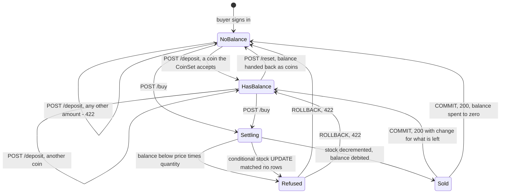
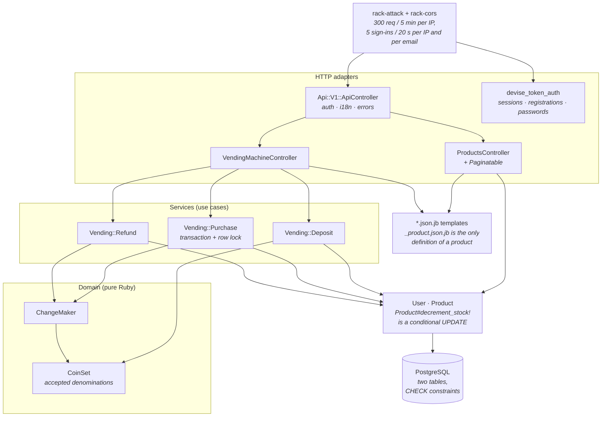

# vendingMachine

A JSON API for a coin-operated vending machine, in Rails 6.1. Sellers stock the
machine; buyers deposit coins, buy products and get their change back. Every
amount is a whole number of coin units, so there is no floating point anywhere
near a balance.

Built as a take-home assessment, so it stays a focused API: no admin UI, no
dashboard, nothing bolted on for show. The part worth reading is not the CRUD; it
is that a purchase mutates two rows two buyers can race for, and that the race is
closed and [proved](#closing-the-oversell-race).

## A recorded session

No screenshots: this is a JSON API, and Swagger UI would not render on the
machine this was captured on, so the evidence is curl. The full unedited session
- sign-in, deposit, buy, reset, health, the test run and the concurrency proof -
is in [`docs/api-walkthrough.md`](docs/api-walkthrough.md). Excerpts:

Authentication is enforced everywhere but sign-in, registration and password reset.

```console
$ curl -i http://127.0.0.1:8400/api/v1/products
HTTP/1.1 401 Unauthorized
{
    "errors": [
        "Authentication is required to perform this action"
    ]
}
```

Deposits go in one coin at a time, and only coins the machine accepts - a deposit
of 7 against the default 5/10/20/50/100 set is a `422 Invalid Amount`. Buying
charges the balance, releases the stock, and reports the coins that come back for
whatever is left (the full product row is in the response too, elided here):

```console
$ curl -X POST http://127.0.0.1:8400/api/v1/buy … -d '{"product_id": 2, "quantity": 2}'
{
    "total_bill": 140,
    "product": { "id": 2, "name": "Cola", "price": 70, "available_count": 6, … },
    "remaining_amount": 60,
    "change": { "coins": { "50": 1, "10": 1 }, "remainder": 0 }
}
```

Roles are enforced: a buyer calling `POST /api/v1/products` gets a
`403 Forbidden` with `{"error": "Only sellers can manage products"}`, and a
seller calling `/deposit` gets `Only buyers can use the vending machine`.

## Endpoints

Every row below marked *signed in*, *seller* or *buyer* needs the devise_token_auth
header trio `access-token` / `client` / `uid`.

| Method | Path | Who | What |
| --- | --- | --- | --- |
| `POST` | `/api/v1/users` | anyone | Register as `seller` or `buyer` |
| `POST` `DELETE` | `/api/v1/users/sign_in`, `/sign_out` | anyone / signed in | Issue and revoke the token trio |
| `POST` `PATCH` | `/api/v1/users/password` | anyone / token | Reset-password mail, then the reset |
| `GET` `PATCH` `DELETE` | `/api/v1/user` | signed in | The current user; `/user/all` lists every user |
| `GET` | `/api/v1/products`, `/products/:id` | signed in | Paginated listing with the seller embedded; one product |
| `POST` `PATCH` `DELETE` | `/api/v1/products` | seller | Stock the machine; changes and deletes only your own rows |
| `POST` | `/api/v1/deposit` | buyer | One coin onto the balance |
| `POST` | `/api/v1/buy` | buyer | `{product_id, quantity}` |
| `POST` | `/api/v1/reset` | buyer | Empty the balance, get coins back |
| `GET` | `/health`, `/products` | anyone | Liveness with a DB check; read-only HTML listing |

`GET /api/v1/products` is bounded by the `Paginatable` concern - 25 rows per page,
`?items=` clamped at 100, pagy's `Link`, `Total-Count`, `Total-Pages`,
`Current-Page` and `Page-Items` headers - and eager-loads the seller, so a full
page of 25 costs five queries (two token lookups, a `COUNT`, the page, one
preload), asserted by a spec that subscribes to `sql.active_record`. Bullet runs with
`raise = true` in the test environment, so reintroducing the N+1 is a failure.

## Running it

Ruby 2.7.2 (see `.ruby-version`), PostgreSQL, and Redis if you want Sidekiq.

```bash
cp .env.sample .env          # fill in values for your machine
bundle install
bundle exec rake db:create db:migrate db:seed
bundle exec rails server -p 8400
```

`db/seeds.rb` is idempotent, refuses to run against production, and creates
`seller@example.com` and `buyer@example.com` (password `password123`, or
`SEED_PASSWORD`) plus six products, one deliberately sold out.

A `Dockerfile` and a `docker-compose.yml` are here too - PostgreSQL, Redis, the
API and a Sidekiq worker on port 8400 - but **they have never been run**: Docker
was unavailable where this was developed, so treat them as unverified. The
walkthrough and everything above were run natively.

## A purchase, state by state

The buyer's balance is the state machine. `POST /buy` opens a transaction,
locks the buyer row, and leaves by exactly one of three doors: change returned,
refused for money, or refused for stock. A non-positive `quantity` is rejected
before the transaction is opened at all.



`Settling` and `Refused` are inside the transaction - nothing a client observes,
and a rollback leaves balance and stock untouched. The two refusals are
distinguishable in the body: `Order Amount exceeded your current Amount` versus
`Product is sold out` / `Not enough stock available`, chosen by re-reading the row.

## Closing the oversell race

A purchase is a read-modify-write across two rows - a balance and a stock count -
so it is the one place here where concurrency costs real money. Three independent
guards, in the order they take effect:

1. **One transaction, one lock order.** `Vending::Purchase` wraps the work in
   `transaction(requires_new: true)` and takes `User.lock.find(buyer.id)`, a
   `SELECT ... FOR UPDATE`, so one wallet cannot be spent twice concurrently.
   Locks are always buyer-then-product, so two sessions cannot build a cycle and
   deadlock. The savepoint is what lets `ActiveRecord::Rollback` unwind the work
   when an outer transaction is already open - RSpec's transactional fixtures.
2. **A conditional `UPDATE` the database evaluates.** `Product#decrement_stock!`
   is deliberately `update_all`, not a model write:

   ```sql
   UPDATE products SET available_count = available_count - :n
   WHERE id = :id AND available_count >= :n
   ```

   Under READ COMMITTED, PostgreSQL re-evaluates that predicate after taking the
   row lock, so of two buyers racing for the last unit exactly one gets a
   non-zero row count. Zero rows means the purchase is refused, not clamped.
3. **`CHECK` constraints underneath both.** `products.available_count >= 0` and
   `users.deposit_amount >= 0`, added by
   `db/migrate/20260924090000_add_non_negative_money_constraints.rb`, so a future
   bug in the application layer cannot persist an impossible number.

`spec/services/vending/purchase_concurrency_spec.rb` proves it rather than
asserting it: transactional fixtures off, four threads on four real connections
released simultaneously through a `Queue` gate, rows cleaned up by hand.

- Four buyers race for **two** units: exactly 2 successes, 2 failures, every
  failure says sold out, `available_count` settles at **0**, and exactly the two
  served buyers are charged.
- One buyer with a balance of **30** buys a 10-unit product from four
  connections: exactly 3 succeed, the balance settles at **0**, stock drops by 3,
  and the fourth is refused for funds.

Swap `decrement_stock!` for the naive `update(available_count: available_count -
quantity)` and **7 of those 10 examples fail** - all four buyers get served out
of two units and `available_count` commits at 1. The proof takes about half a
second, so it stays in the default suite.

## Two bugs that were actually in here

- **The funds check was inverted.** The guard read the wrong way round, so a
  purchase was permitted exactly when the buyer could *not* afford it and
  refused when they could. The balance went negative; nothing complained. It is
  now `return INSUFFICIENT_FUNDS if deposit_amount < total_amount`, with request
  and service specs on both sides of the boundary, and a `CHECK` constraint
  behind it.
- **Authentication had been switched off.** An earlier automated pass removed the
  `before_action :authenticate_user!` so placeholder specs would pass. It is back
  on `Api::V1::ApiController`, which the products, vending-machine and user
  controllers inherit from, and the 401 (no token) and 403 (wrong role) cases are
  asserted by `spec/support/shared_examples/authentication.rb` and
  `spec/requests/api/v1/products/authorization_spec.rb`.

## Layers, and which way they point

Controllers are HTTP adapters: parse params, call exactly one service, render
its result. Services own the rules and the transaction boundary and return a
`ServiceResult`. The domain objects underneath are pure - no ActiveRecord, no
HTTP, no clock - and so are the cheapest part to test. `buy` is a dozen lines of
parse-delegate-render, which is why the concurrency proof can drive
`Vending::Purchase` directly.



Two tables and no join model: a purchase is not recorded anywhere. Where things
live:

```
app/domain/              coin_set.rb  change_maker.rb  product_attributes.rb
app/services/vending/    deposit.rb  purchase.rb  refund.rb  (+ ServiceResult above)
app/controllers/api/v1/  api_controller.rb + products, vending_machine, users, devise
app/controllers/concerns/  act_as_api_request  exception_handler  localizable  paginatable
app/views/api/v1/        .json.jb templates; _product.json.jb shared by every endpoint
rubocop/                 a custom cop - a migration must add an index - and shared config
swagger/v1/swagger.yaml  generated OpenAPI 3.0, with real examples
```

## Coins, change, and the currency seam

`CoinSet` is an immutable value object; `CoinSet.default` reads
`COIN_DENOMINATIONS` and falls back to `5,10,20,50,100`. Every service takes a
`coin_set:` keyword, so running the machine in another currency is configuration,
and a test needing odd coins passes its own instance instead of stubbing a
constant. That is the seam a successor would reach for; a plugin architecture
here would be invention.

`ChangeMaker` turns a balance into coins, greedy, largest first - provably optimal
for a canonical set like the default one. A non-canonical set (1, 3, 4) may get
more coins than the minimum; the caveat is at the top of the class rather than
hidden, because the alternative is unbounded in memory for an unbounded balance. A
balance the coins cannot pay exactly comes back as coins *plus* a non-zero
`remainder` - 103 yields `{"coins": {"100": 1}, "remainder": 3}` - so the machine
never silently swallows the difference.

## Environment

| Variable | Default | What it does |
| --- | --- | --- |
| `DB_HOST` `DB_USERNAME` `DB_PASSWORD` | `localhost` / `postgres` / `postgres` | PostgreSQL connection |
| `DB_NAME` | `vending_machine` | Database; the test database is `<name>-test` |
| `DB_POOL` | `RAILS_MAX_THREADS`, else `5` | ActiveRecord pool size |
| `COIN_DENOMINATIONS` | `5,10,20,50,100` | Coins accepted and paid out |
| `SEED_PASSWORD` | `password123` | Password for the demo accounts |
| `REDIS_URL` | none (required in production) | Sidekiq; Action Cable falls back to `redis://localhost:6379/1` |
| `SITE_TITLE` | none | Rendered in reset-password mail; the mailer raises without it |
| `SERVER_URL` `MAILER_DOMAIN` `SENDGRID_API_KEY` `DEFAULT_FROM_EMAIL_ADDRESS` | none | Mail delivery (the SMTP username is the literal `apikey`) |
| `JOB_MONITOR_USERNAME` `JOB_MONITOR_PASSWORD` | none, on purpose | Basic auth for `/jobmonitor` |

The usual Rails knobs also apply: `PORT` (3000), `RAILS_ENV`,
`RAILS_MAX_THREADS`/`RAILS_MIN_THREADS` (5), `TZ`
(`Eastern Time (US & Canada)`), `RAILS_SERVE_STATIC_FILES`, `RAILS_LOG_TO_STDOUT`.
`.env.sample` lists everything. The Sidekiq UI credentials have no default
deliberately - the initializer reads them with `ENV.fetch` and no fallback, so
leaving them unset makes every `/jobmonitor` request fail rather than succeed with
a guessable password. The database credentials *do* default to
`postgres`/`postgres` for local convenience; set them explicitly anywhere that
matters.

## Working on the code

```bash
bundle exec rspec                    # whole suite
bundle exec rspec spec/services      # one directory, or one file
bundle exec rake linters             # rubocop + reek; `-- -a` to autocorrect
bundle exec rake swagger:generate    # regenerate swagger/v1/swagger.yaml
bundle exec rake db:seed             # reload the demo data
```

The suite is **371 examples, 0 failures** in 5.63 s at **98.66%** line coverage
(1693/1716), SimpleCov reporting into the gitignored `coverage/`. Both linters come
back clean - no `.rubocop_todo.yml`, no suppressed backlog - and rswag generates
the OpenAPI document from the request specs, so the docs cannot drift from them.

## What it deliberately does not do

- **No coin inventory.** `ChangeMaker` computes which coins *would* be
  dispensed, and that is all: no coin table, no float, no endpoint, nothing
  tracking how many 50s the machine physically holds. Modelling one means a new
  table and a second concurrency story.
- **No order history.** A purchase mutates a balance and a stock count and
  returns a body; nothing is written down, so there is no ledger to reconcile.
- **`GET /api/v1/user/all` is unbounded.** Pagination was added where a caller
  can grow the data - products. That endpoint still returns every user.
- **Sidekiq is configured but nearly idle.** Its only job is delivering the
  Devise reset-password mail; the worker exists to prove the wiring.
- **The HTML pages are a debugging convenience.** `/products` is
  unauthenticated, read-only, unstyled and write-free. It is not a UI.
- **Authorization is role checks in controllers.** Two roles and five endpoints;
  a policy-object layer would be more machinery than the rules justify.
- **The money endpoints are not separately throttled.** rack-attack limits
  requests per IP and sign-ins per IP and per email; `deposit` and `buy` share the
  general limit.
- **Versioned by path only.** No deprecation mechanism, no content negotiation
  between versions; `/api/v2` would be a new namespace.
